# 100daysPython

I am doing the bootcamp of python for 100 days following the syllabus of Dr.Angela Yu without actually watching her videos.
I am mostly doing challenges and project on a daily basis.
And i wish to complete this bootcamp without taking any gaps as before. So Wish me Luck! After 18 days i'm pretty confident for building real world project. And i will create some awesome projects while completing this bootcamp..

## day-1

[day-1:  Working with variables in Python to manage data.
](url)
On this day,I learned about variables in Python and how to manage different data using those variables.
> Day 1 Project: Band Name Generator

## day-2

[day-2:  Understanding Datatypes and how to manipulates Strings.
](url)
Python Primitive Data Types
Type Error, Type Checking and Type Conversion
Data Types
Mathematical Operations in Python
BMI Calculator
Number Manipulation and F Strings in Python
> Day 2 Project: Tip Calculator
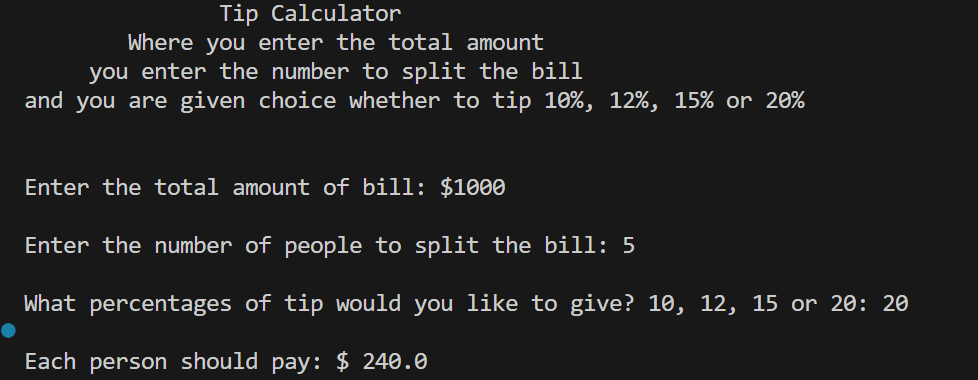

## day-3

Control Flow with if / else and Conditional Operators

Nested if statements and elif statements

Multiple If Statements in Succession

Logical Operators

> Day 3 Project: Treasure Hunt
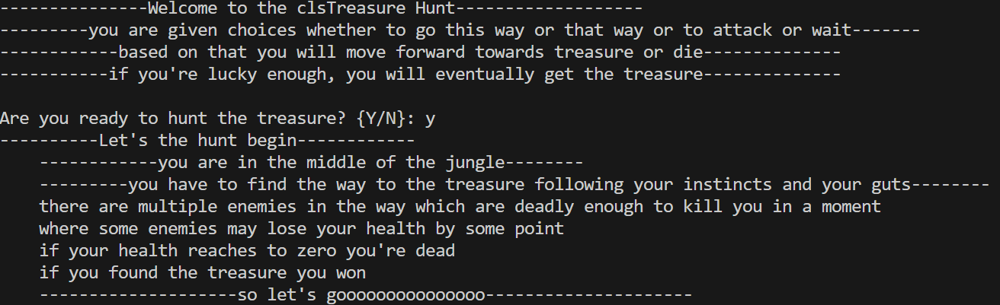
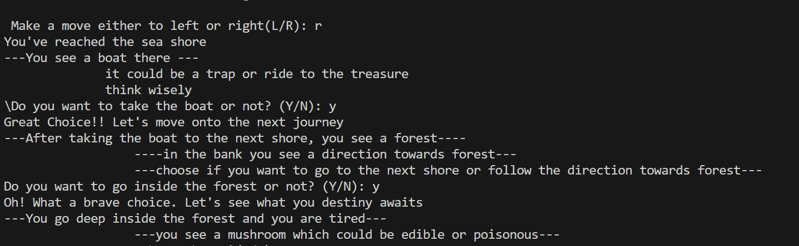
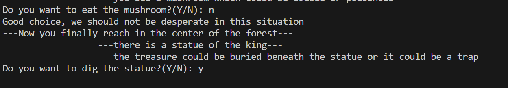
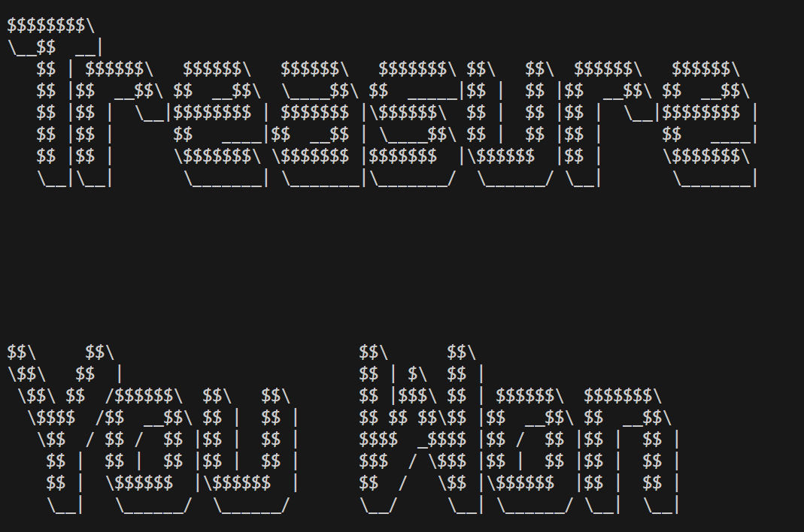

## day-4

Random Module

Understanding the Offset and Appending Items to Lists

IndexErrors and Working with Nested Lists

> Day 4 Project: Rock Paper Scissor Game
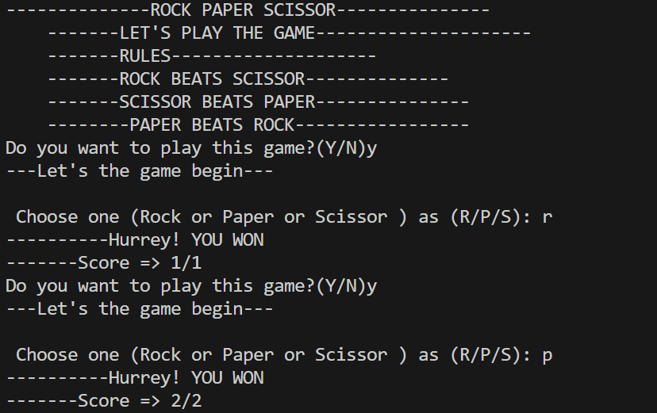
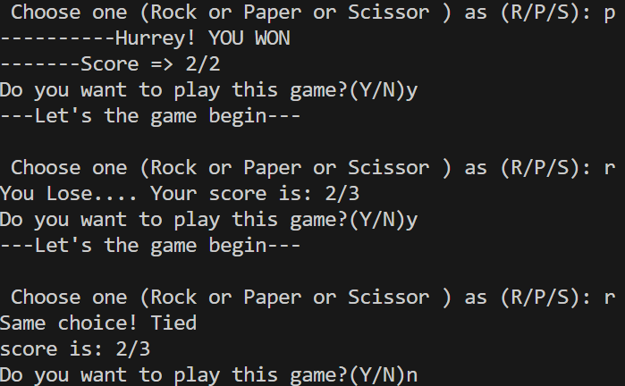

## day-5

Using the for loop with Python Lists

for loops and the range() function

> Day 5 Project: Password Generator
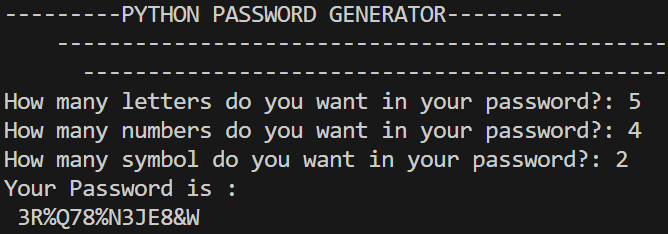

## day -7

On this day, I learnt how to break a big problem into small chunks and solving them separately. I than created a flowchart for the problem to visualize.

> Day 7 Project: Hangman Game

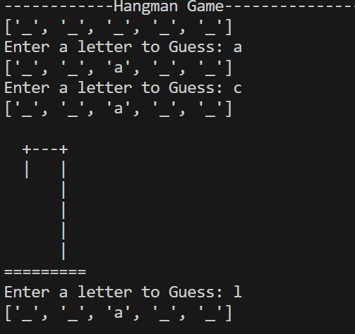

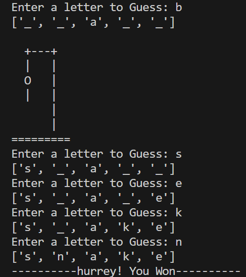

## day -8

> Day 8 Project: Caesar Cipher Encryption and Decryption
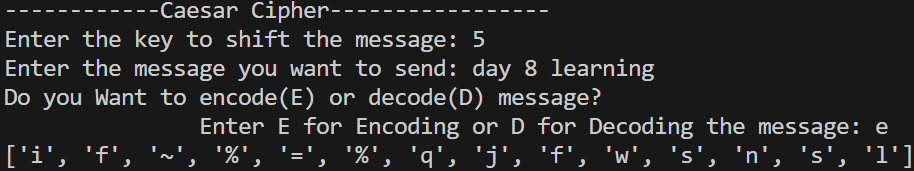

## day -9

> Day 9 Project: Secret Auction

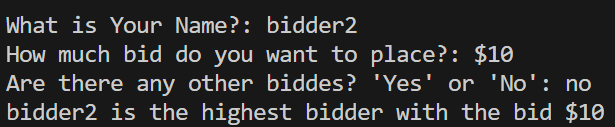

## day-70

I have completed day 70 which is about Version Control using Git and remote repository called Github.
this line is written in local ide and i will push it using git.

I am preparing for something cool so i am focusing on what's important for that stuff but i will complete all the 100 days as i have promised earlier....
